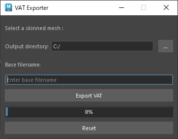

# Maya-VAT-Exporter
*Exports Vertex Animation Texture from Maya2026*

Developed for Maya 2026 using Maya.cmds to interact with Maya, Pillow for writing data to 32bit EXR
 
Please learn how to use this script from How-To
 

 

## Key Features 
* 32bit RGBA EXR format
* Output 2 images
  - Offset positions from unanimated model & Normals
    - R Channel: X
    - G Channel: Y
    - B Channel: Z

## Dependencies:

  ### Libraries:

  Go to directry including mayapy.exe & Enter this command:	
  
    mayapy -m pip install opencv-python OpenEXR Imath

  See how to find mayapy.exe:
  https://help.autodesk.com/view/MAYAUL/2026/ENU/?guid=GUID-D64ACA64-2566-42B3-BE0F-BCE843A1702F
  
  
## How-To
* Make sure the time slider is within the range of the animation you want to output
* Select a skinned mesh
* Select the output directory 
* Input file name
* Press Export button named [Export VAT]
* If you want to continue to create other VATs, press  [Reset]

## Technical showcase
Example texture used in game  
First row is header  

## Forked from
Time-TechArt / Maya-VAT-Exporter
https://github.com/Tim-TechArt/Maya-VAT-Exporter.git